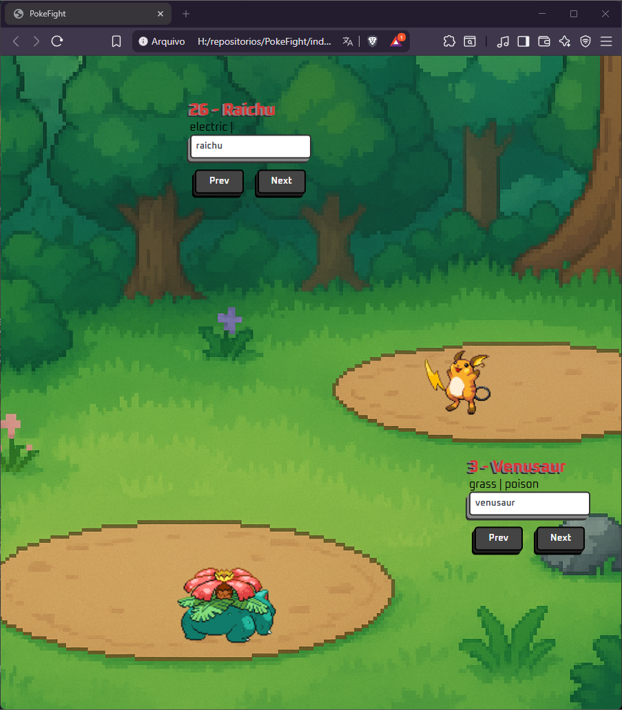

  <h1>Projeto Pokedex</h1> 
  
  
Projeto desenvolvido com o intuito de aprimorar meus conhecimentos em consumo de APIs, utilizando a PokeAPI

---

## Sobre o Projeto

Este projeto tem como propósito simular um cenário de batalha, como viamos nos games. 
Nele podemos pesquisar Pokémon pelo nome ou número de registro da Pokédex, ou navegar através dos botões 
avançar e retorceder para visualizar seus sprites da quinta geração, considerada uma das mais bonitas, com animações em 2D.
---

## Tecnologias Utilizadas

- **HTML5** – estrutura da página.
- **CSS3** – estilização personalizada.
- **JavaScript** – Consumo de API.
- **PokeAPI** – API gratuita utilizada.

---

## Preview

